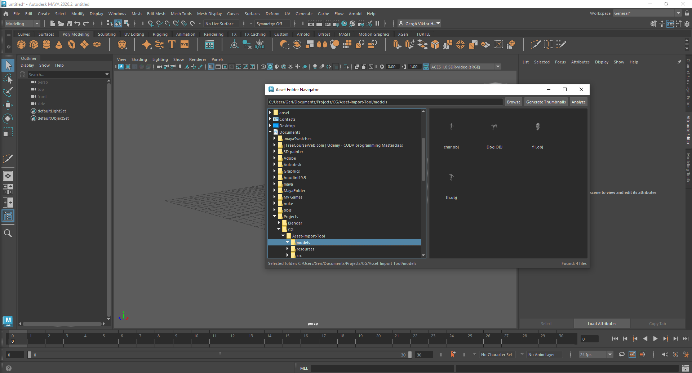

# Asset Import Panel

A Maya folder navigation panel with thumbnail support.  
Browse asset directories, preview files as icons, and generate thumbnails directly inside Maya.  
Includes basic mesh analysis such as vertex count, face count, number of n-gons, and UV set names.

---

## Features

- Folder tree (left panel) and file list (right panel)
- Icon and thumbnail view for assets
- Automatic thumbnail lookup with fallback to default icons
- Thumbnail generation with a progress bar
- Quick mesh analysis (vertices, faces, n-gons, UVs)

---

## Requirements

- Autodesk Maya (2022+ recommended)
- Python 3 (Maya’s bundled Python)
- PySide (included with Maya)

---

## Result



# Demo


---

## Installation (User)

1. Copy the package folder into your Maya scripts directory.

2. In the Maya Script Editor (Python tab), run:

```python
import asset_nav_panel
asset_nav_panel.show()

```
## Development & Future Work

This tool is under active development. Current improvements include:

- **Thumbnail workflow:** 
    - mirrored project thumbnails, 
    - per-user cache, 
    - regeneration based on model changes  


 
