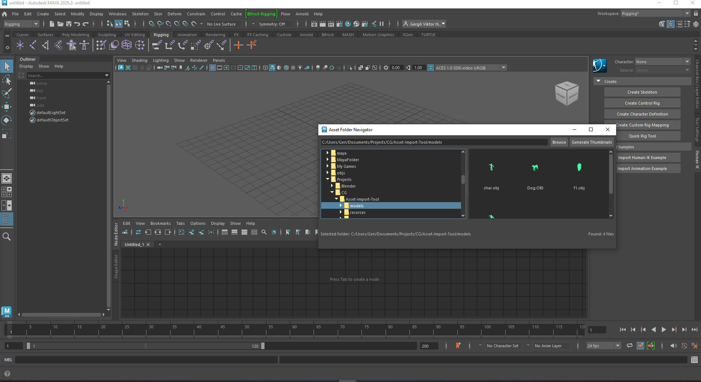

# Asset Import Panel

A Maya folder navigation panel with thumbnail support.  
Browse asset directories, preview files as icons, and generate thumbnails directly inside Maya.

---

## Features

- Folder tree (left) and file list (right)
- Icon / thumbnail view for assets
- Automatic thumbnail lookup with fallback to default icons
- Thumbnail generation with progress bar

---

## Requirements

- Autodesk Maya (2022+ recommended)
- Python 3 (Maya’s bundled Python)
- PySide (included with Maya)

---
## Result



## Installation (User)

1. Copy the package folder into your Maya scripts directory:


2. In Maya Script Editor (Python tab):

```python
import asset_nav_panel
asset_nav_panel.show()
```
## Development & Future Work

This tool is under active development. Current improvements include:

- **Thumbnail workflow:** mirrored project thumbnails, per-user cache, regeneration based on model changes  
- **UI enhancements:** progress bars in-panel and floating, improved focus handling, sorting/filtering assets   

### Planned Features
- Quick import of selected assets into Maya Option button 
- Model analysis: check for missing geometry, unsupported formats, or errors before import  
